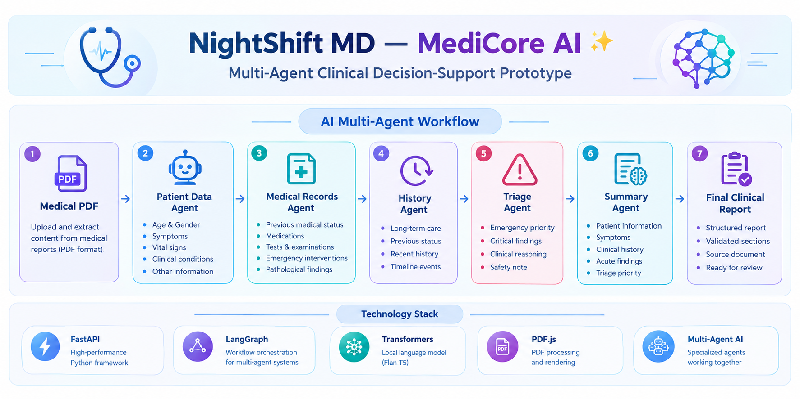

# 🚨 EmergencyFlow AI — Multi-Agent Emergency Triage System

<p align="center">
  
</p>

> An AI-powered multi-agent emergency triage and clinical decision-support prototype for analyzing medical reports and generating structured emergency assessment insights.

---

## 📌 Overview

**EmergencyFlow AI** is a Multi-Agent AI system designed to process medical reports and transform unstructured clinical information into a structured emergency assessment.

The system accepts a medical report in **PDF format** and processes it through a sequence of specialized agents that extract patient information, medical records, patient history, emergency findings, and an AI-generated clinical summary.

The project demonstrates the practical application of:

- Artificial Intelligence
- Multi-Agent Systems
- Natural Language Processing
- Large Language Models
- Workflow Orchestration
- Clinical Information Extraction
- AI-Assisted Decision Support

---

## ✨ Features

- 📄 Medical PDF report processing
- 👤 Patient information extraction
- 📋 Medical records extraction
- 🕒 Patient history and timeline organization
- 🚨 Emergency triage assessment
- 🔎 Critical clinical findings detection
- 🧠 AI-generated clinical summary
- 📊 Structured final clinical report
- ✅ Final report validation
- 💬 AI Consultation Chat
- 🌐 Custom web-based interface
- 🤖 Multi-Agent workflow architecture
- ⚡ End-to-end automated processing

---

## 🎯 Project Objective

The main objective of **EmergencyFlow AI** is to demonstrate how multiple AI agents can work together to organize and analyze information from medical reports.

The system follows a sequential workflow:

```text
Medical PDF
     ↓
Patient Data Agent
     ↓
Medical Records Agent
     ↓
History Agent
     ↓
Triage Agent
     ↓
Summary Agent
     ↓
Final Clinical Report
